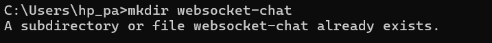
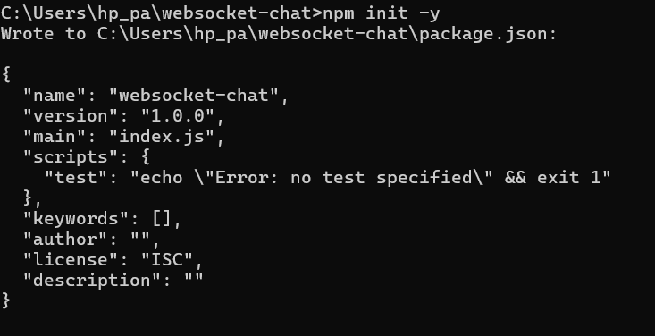
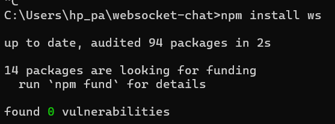
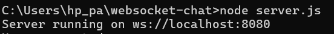
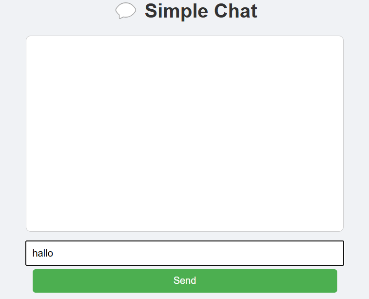
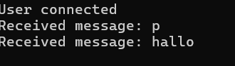

# ArticlesWebsocket
| UTS |  Pemrograman Web 2  
|-------|---------
| NIM   | 312310632
| Nama  | fakhri afif muhaimin
| Kelas | TI.23.A6
| Dosen |  Agung Nugroho, S.Kom., M.Kom.
| Link Artikel | https://medium.com/@fakhriafif788/websocket-membuka-era-baru-komunikasi-real-time-dalam-pengembangan-web-f055c8edf968 |
# 💬 WebSocket: Membuka Era Baru Komunikasi Real-time dalam Pengembangan Web

## Pendahuluan

Di era digital yang serba cepat, pengguna mengharapkan aplikasi web yang responsif dan real-time. WebSocket hadir sebagai solusi atas keterbatasan protokol HTTP tradisional yang bersifat stateless dan berbasis request-response.

Teknologi ini memungkinkan koneksi dua arah (bidirectional) antara client dan server yang tetap terbuka, sehingga mendukung pertukaran data real-time tanpa permintaan HTTP baru. README ini membahas konsep dasar WebSocket, perbedaannya dengan HTTP, dan implementasi praktis berupa aplikasi chat sederhana.

---

## 🔍 Apa Itu WebSocket?

WebSocket adalah protokol komunikasi full-duplex berbasis TCP yang memungkinkan pertukaran data dua arah antara client dan server melalui satu koneksi yang persisten.

- URI: `ws://example.com/socketserver` atau `wss://secure.example.com/socketserver`
- Tidak perlu permintaan ulang seperti HTTP
- Efisien dan responsif untuk komunikasi real-time

---

## 🔄 WebSocket vs HTTP

| Aspek              | HTTP                              | WebSocket                          |
|-------------------|-----------------------------------|------------------------------------|
| Model Komunikasi  | Request-Response                  | Full-duplex, Bidirectional         |
| Overhead Koneksi  | Tinggi (banyak header)            | Ringan setelah handshake awal      |
| Latency           | Tinggi                            | Rendah                             |
| Push Capability   | Tidak native (butuh workaround)   | Native push oleh server            |

---

## ⚙️ Cara Kerja WebSocket

1. **Handshake**: Client mengirim request HTTP khusus untuk upgrade koneksi ke WebSocket.
2. **Komunikasi**: Setelah berhasil, koneksi terbuka dan kedua pihak bisa saling kirim pesan.
3. **Penutupan**: Koneksi ditutup secara eksplisit oleh client atau server.

---

## 🧠 Kasus Penggunaan WebSocket

- **Chat Real-time** (WhatsApp Web, Slack)
- **Notifikasi Instan**
- **Game Online**
- **Kolaborasi Dokumen**
- **Streaming Data IoT**

---

## 🧪 Eksperimen: Aplikasi Chat Sederhana

### 🔧 Langkah 1: Persiapan Proyek

```bash
mkdir websocket-chat
```

```
cd websocket-chat
```

```
npm init -y
```


```
npm install ws
```


#### 🚀 Langkah 2: Membuat Server WebSocket (server.js)
 ```
const WebSocket = require('ws');
const wss = new WebSocket.Server({ port: 8080 });

wss.on('connection', (ws) => {
  console.log('User connected');
  ws.on('message', (message) => {
    console.log('Received message: ' + message);
    wss.clients.forEach(client => {
      if (client !== ws && client.readyState === WebSocket.OPEN) {
        client.send(message);
      }
    });
  });
  ws.on('close', () => console.log('User disconnected'));
});

console.log('Server running on ws://localhost:8080');
```

### 💻 Langkah 3: Membuat Antarmuka Client (public/index.html)
```
<!DOCTYPE html>
<html lang="en">
<head>
  <meta charset="UTF-8" />
  <meta name="viewport" content="width=device-width, initial-scale=1.0"/>
  <title>ChatApp</title>
  <style>
    body { font-family: sans-serif; background: #f0f2f5; padding: 20px; text-align: center; }
    #messages { max-width: 500px; height: 300px; overflow-y: auto; background: #fff; border: 1px solid #ccc; margin: 10px auto; padding: 10px; }
    input, button { max-width: 500px; padding: 10px; margin-top: 5px; width: 100%; }
    button { background: #4CAF50; color: white; border: none; cursor: pointer; }
    button:hover { background: #45a049; }
  </style>
</head>
<body>
  <h1>💬 Simple Chat</h1>
  <div id="messages"></div>
  <input type="text" id="messageInput" placeholder="Type a message…" />
  <button id="sendButton">Send</button>
  <script>
    const socket = new WebSocket('ws://localhost:8080');
    const messages = document.getElementById('messages');
    const messageInput = document.getElementById('messageInput');
    const sendButton = document.getElementById('sendButton');

    socket.onopen = () => console.log('Connected');
    socket.onmessage = (e) => {
      const msg = document.createElement('div');
      msg.textContent = e.data;
      messages.appendChild(msg);
      messages.scrollTop = messages.scrollHeight;
    };

    sendButton.onclick = () => {
      const text = messageInput.value.trim();
      if (text) {
        socket.send(text);
        messageInput.value = '';
      }
    };

    messageInput.addEventListener('keypress', (e) => {
      if (e.key === 'Enter') sendButton.click();
    });
  </script>
</body>
</html>
```
### ▶️ Menjalankan Aplikasi
1.jalankan server
```
node server.js
```
2.Buka beberapa tab browser
```
http://localhost:8080
```
pastikan ```index html```di buka lewat server lokal atau ekstensi live server untuk menghindari pembatasan CORS



### 📈 Observasi dari Eksperimen
Melalui eksperimen ini, saya mengamati beberapa hal penting tentang WebSocket:



⚡ Kecepatan Komunikasi: Pesan yang dikirim muncul hampir secara instan di semua browser yang terhubung.

📶 Penggunaan Sumber Daya: Lebih efisien dibanding polling karena tidak ada permintaan berulang.

🧰 Kemudahan Implementasi: Dengan library seperti Socket.IO (jika digunakan), implementasi menjadi mudah.

📊 Skalabilitas: Server tetap responsif meskipun ada lebih dari 10 koneksi simultan.

🔄 Keandalan Koneksi: Socket.IO (atau solusi serupa) menangani pemutusan dan rekoneksi otomatis.

### ✅ Kesimpulan
WebSocket merupakan teknologi revolusioner yang telah mengubah cara aplikasi web berkomunikasi dengan server. Dengan kemampuan komunikasi dua arah yang real-time dan efisien, WebSocket memungkinkan pengembangan aplikasi web yang lebih interaktif dan responsif.
Dari eksperimen yang saya lakukan, jelas terlihat bahwa WebSocket memberikan keuntungan signifikan dalam hal kinerja, efisiensi bandwidth, dan pengalaman pengguna untuk aplikasi yang membutuhkan komunikasi real-time. Aplikasi chat sederhana yang saya bangun menunjukkan betapa mudahnya mengimplementasikan WebSocket menggunakan tools modern, dan betapa powerful hasilnya.
Seiring berkembangnya ekosistem web, WebSocket akan terus menjadi komponen penting dalam arsitektur aplikasi web modern. Pemahaman mendalam tentang teknologi ini tidak hanya bermanfaat untuk mengembangkan aplikasi real-time yang efisien, tetapi juga memberikan wawasan tentang bagaimana internet berevolusi dari model request-response tradisional menuju komunikasi yang lebih dinamis dan interaktif.

### 📚 Referensi
WebSocket API - MDN Web Docs

RFC 6455 - The WebSocket Protocol

Socket.IO Documentation

Wang, V., Salim, F., & Moskovits, P. (2013). The Definitive Guide to HTML5 WebSocket. Apress.
